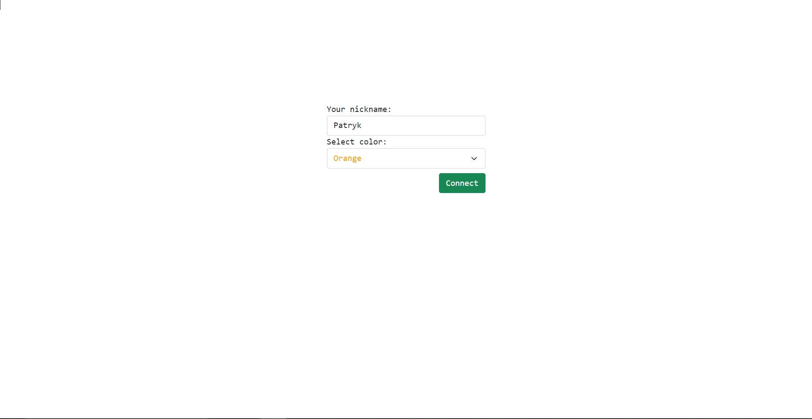
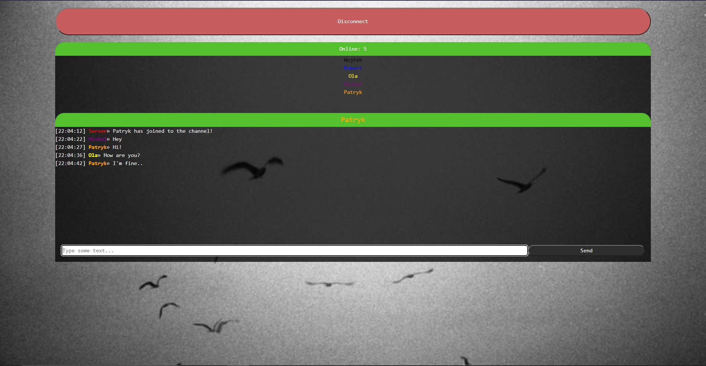
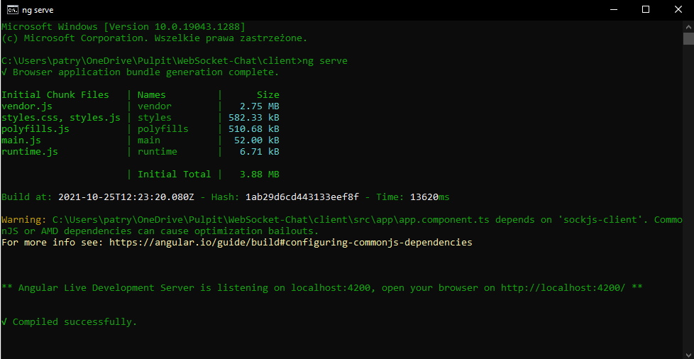
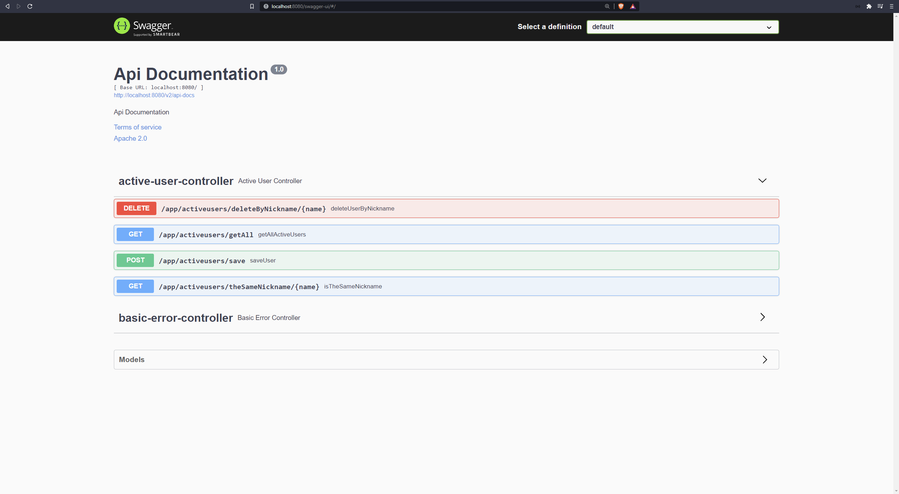
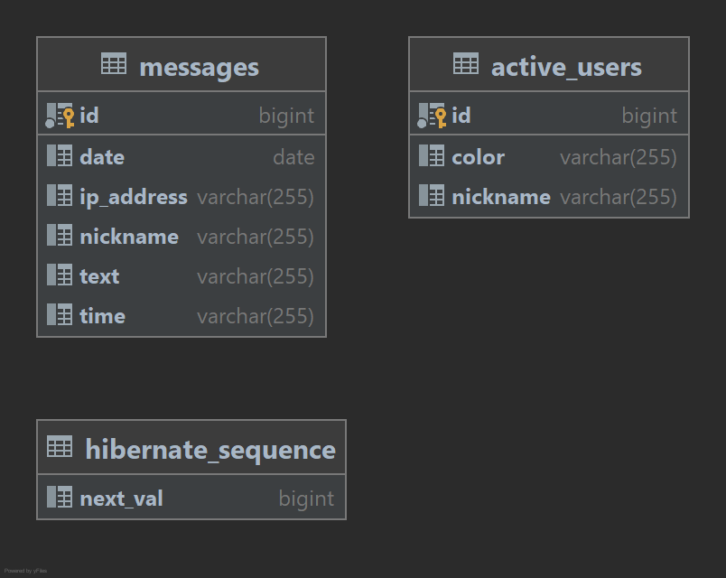

# WebSocket-Chat

## Description
***

Application is an online chat created for education purposes. An app is based on WebSocket protocol to have a
bidirectional, full-duplex connection between client and server by TCP connection. To send messages I used STOMP protocol.

##Demo



##Features
***
There are several features:
* form-validation
    * user nickname must be at least 3 characters long
    * nickname can contain only letters, digits and underscore
    * max length of nickname is 16 characters
    * user cannot enter if his nickname is already taken by other person
    * max length of text message is 255 characters
* user interface
    * the default nickname color is black but user can change it by picking from dropbox
    * user can send messages once every 3 seconds
    * list of online users is updating every 15 seconds

##Prerequisites
***

<ul>
<li>Java 11</li>
<li>Angular 12</li>
<li>Maven 3.8.1</li>
<li>npm 6.14.13</li>
<li>Node.js 14.17.3</li>
<li>MySQL or other</li>
<li>Git (optional)</li>
</ul>

##Run app
***
###Standard

1. Make sure that you follow up all prerequisites
2. Clone repository `https://github.com/p-wojt/websocket-chat.git`
####Frontend
3. Open `client` directory and execute command here to start frontend application:
`ng serve`

####Backend
4. Open `server` directory and configure your database in `application.yml`
<br>
Standard configuration is prepared for `MySQL` and will look like this:
```YAML
spring:
  datasource:
    username: "user"
    password: "password"
    url: "jdbc:mysql://mysql_db:3306/websocket-chat?allowPublicKeyRetrieval=true&useSSL=false"
    driver-class-name: com.mysql.cj.jdbc.Driver

  jpa:
    hibernate:
      ddl-auto: create-drop
```
Database
* Create user and set username & password
* Create database schema ex. "websocket-chat"
5. Make sure that you have installed all dependencies: `mvn clean install package`
6. Now run package `java -jar .\websocket-chat.jar`
###Docker (faster way)
1. Make sure that your docker app is running
2. Enter main directory
3. Run command `docker-compse up` to create & ON images


<br><b>Next step is just open your browser and go `http://localhost:4200`</b>

##API Documentation
***

For API documentation I used Swagger-UI. Not much to read but I sure that someone might need it :)
###Swagger-UI / Springfox




## Database diagram
Simple database diagram

